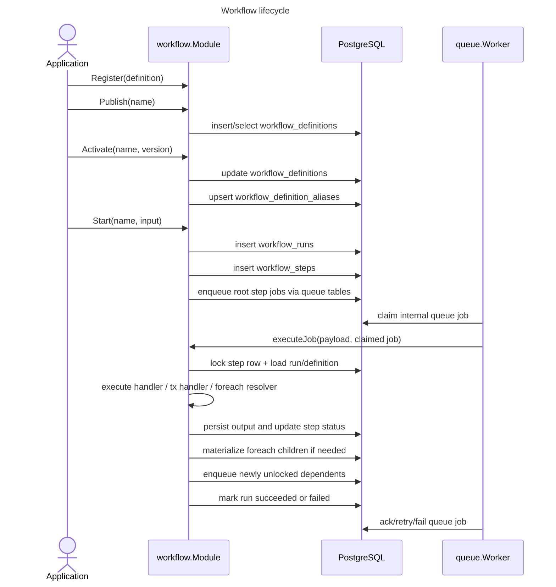
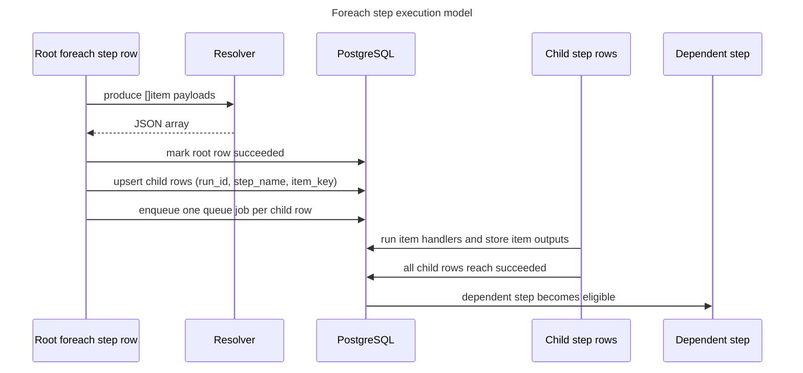

# Workflow Package

`workflow` turns PostgreSQL rows plus `queue` jobs into durable DAG-style workflow runs.

This document is meant for humans maintaining the package. It explains the mental model, the file layout, the runtime lifecycle, and the invariants that are easy to miss when reading the code cold.

## Mental Model

- A `Definition` is an in-memory DAG built with the DSL in `workflow/definition.go`.
- A published definition becomes an immutable row in `workflow_definitions`.
- An active definition is the version referenced by `workflow_definition_aliases`.
- A run is one execution in `workflow_runs`.
- A step row in `workflow_steps` is the runtime source of truth for one logical step execution.
- `queue` only drives execution; PostgreSQL remains the system of record for workflow state.

## Code Map

| File | Responsibility | Change here when... |
| --- | --- | --- |
| `workflow/definition.go` | Builder DSL, validation, graph generation, content hashing | You add or validate definition-level behavior |
| `workflow/module.go` | Module facade, schema management, publish/activate/list APIs | You change definition lifecycle or public module APIs |
| `workflow/store.go` | Query helpers and row scanners | You change schema, list filters, or read/write persistence helpers |
| `workflow/runtime.go` | Run creation, worker execution, step transitions, fan-out materialization | You change runtime behavior or step scheduling |
| `workflow/state.go` | In-memory output key protocol and root/item helpers | You change how step outputs or foreach items are addressed |
| `workflow/types.go` | Core records, statuses, `StepContext`, worker config | You change public workflow types or runtime contracts |
| `workflow/diff.go` | Graph diffing between versions | You change version comparison behavior |

## Lifecycle Overview

## Foreach Fan-Out Model

## Important Invariants

### 1. Every logical step has a root row

- Root step rows always use `item_key = ''`
- Foreach child items reuse the same `step_name` with a concrete `item_key`
- The helper constant is `rootStepItemKey` in `workflow/state.go`

This is why graph assembly and scheduling both distinguish between the root row and child rows.

### 2. Output lookup has two forms

- Root step output key: `step-name`
- Foreach item output key: `step-name[item-key]`

That protocol is centralized in `workflow/state.go` so it does not get reimplemented with ad hoc string concatenation.

### 3. Dependency readiness is "all rows succeeded"

When a step depends on a foreach node, the dependent step must wait until:

- the root foreach row succeeded, and
- every materialized child row for that dependency also succeeded

The runtime now expresses this explicitly through `allStepRecordsSucceeded(...)`.

### 4. Queue jobs are not the source of truth

`queue` is the execution engine, but the durable workflow state lives in:

- `workflow_runs`
- `workflow_steps`

If queue state and workflow state ever disagree, the workflow tables win.

## PostgreSQL Rules Worth Remembering

- `getStepByQueueJobID(...)` uses `FOR UPDATE` so one transaction owns step-state changes for the claimed queue job
- `updateRunStatus(...)` intentionally preserves `completed_at` unless the caller provides a new terminal timestamp
- `materializeForEachChildren(...)` uses `ON CONFLICT (run_id, step_name, item_key)` so replaying a foreach parent stays idempotent
- `Activate(...)` promotes one version and deprecates others in one statement to avoid split-brain activation state

## Common Maintenance Tasks

### Add a new step capability

1. Update the public types in `workflow/types.go`
2. Teach the builder/validator in `workflow/definition.go`
3. Extend runtime behavior in `workflow/runtime.go`
4. Update graph/UI expectations if the new capability changes node semantics

### Change run listing or filtering

1. Start in `workflow/store.go`
2. Keep `listRuns(...)` and `countRuns(...)` on the same shared filter builder
3. Update the admin UI API callers if the filter surface changes

### Debug a stuck run

1. Inspect `workflow_runs.status`
2. Inspect all `workflow_steps` rows for the run ordered by `id`
3. Check whether a dependency has a child row still in `pending`, `queued`, `running`, or `waiting_retry`
4. Verify the internal queue job exists for queued steps

## Maintenance Guidance

- Prefer extracting helpers when behavior depends on root-vs-item row semantics
- Keep SQL column lists centralized so schema changes do not drift across queries
- Comment the why for non-obvious SQL, especially row locking, lifecycle transitions, and idempotent upserts
- Treat `runtime.go` as orchestration code: move protocol details into helpers when possible

## Safe Refactor Boundaries

Low-risk areas for future cleanup:

- split `executeJob(...)` into load/execute/finalize phases if it grows again
- keep state-key and foreach helper logic in `workflow/state.go`
- keep store query builders shared between list and count code paths

If you are unsure where to start, trace one successful run from `StartVersion(...)` to `executeJob(...)` and then to `finalizeRunIfDone(...)`.
